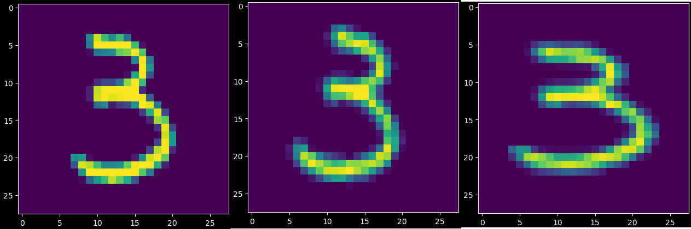

# Digit Recognizer

A Python Jupyter notebook with a simple computer vision implementation for creating a very acceptable submission for the Digit Recognizer challenge in Kaggle: https://www.kaggle.com/competitions/digit-recognizer

The image above shows:

* The digit number 4777
* A slightly rotated version of itself
* A slightly zoomed version of itself

The algorithm performs these augmentations for every digit in the dataset, effectively increasing its size to three times the original. The labels are triplicated to compensate for this.

The implemented algorithm returned a testing accuracy of $0.986380934715271$ as is, but the performance can be easily improved.
